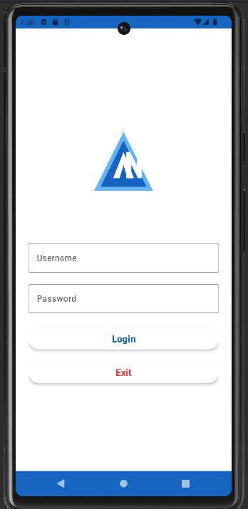
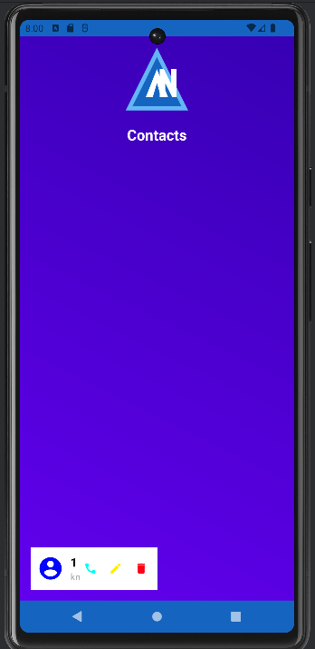
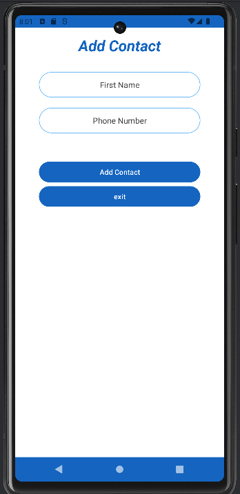

# academix-mobile-app

Academix - Starter Contact (V1.0)
Academix is a simple and intuitive Android application designed to manage contacts. This starter version (V1.0) provides basic functionalities for adding, viewing, and deleting contacts. It’s built using Java and SQLite for local data storage.

Features
Add Contacts: Easily add new contacts with a username and phone number.

View Contacts: Display a list of all saved contacts.

Delete Contacts: Remove unwanted contacts with a single click.

User Authentication: Secure login with username and password.

Simple UI: Clean and user-friendly interface.

Technologies Used
Programming Language: Java

Database: SQLite

UI Framework: Android XML Layouts

Dependencies:

Material Components for Android

RecyclerView for displaying contacts

Screenshots
Login Screen	Contact List	Add Contact
		

Getting Started
Follow these steps to set up and run the project on your local machine.

Prerequisites
Android Studio (latest version recommended)

Android SDK

Java Development Kit (JDK)

Installation
Clone the repository:

bash
Copy
git clone https://github.com/your-username/Academix.git
Open the project in Android Studio.

Sync the project with Gradle to download dependencies.

Connect an Android device or emulator.

Build and run the app.

Usage
Login:

Use the default credentials:

Username: louay

Password: louay

Add a Contact:

Navigate to the "Add Contact" screen.

Enter the contact's username and phone number.

Save the contact.

View Contacts:

All saved contacts are displayed in a list on the home screen.

Delete a Contact:

Click the delete icon next to a contact to remove it.

 documentation
Future Enhancements
User Registration: Allow new users to register.

Edit Contacts: Add functionality to edit existing contacts.

Search Contacts: Implement a search feature to find contacts quickly.

Backup and Restore: Add options to backup and restore contacts.

Improved UI: Enhance the user interface with animations and themes.

License
This project is licensed under the MIT License. See the LICENSE file for details.

Enjoy using Academix - Starter Contact (V1.0)! 🚀

